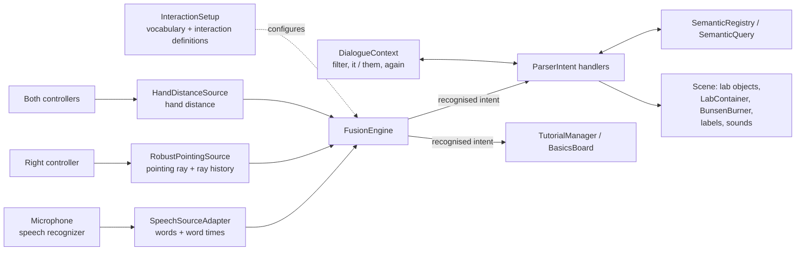

# Orga – Team 12 · Multimodal User Interfaces (SS 2026)

This repository is the entry point for grading. It describes our application idea, lists the requirements we want to have graded and who implemented them, explains the architecture, links to all relevant materials, lists all supported user interactions, and explains how to start the prototype, and lists the external sources we used.

**Prototype:** a VR chemistry lab for children. Kids create lab equipment, add chemicals, mix them and heat them on a Bunsen burner, controlled by **speech**, **pointing** and **hand gestures** instead of controller menus. Built with Unity 6000.3.11f1 for the Meta Quest 3.


## Contents

1. [Team](#1-team)
2. [Application idea](#2-application-idea)
3. [Requirements considered for grading](#3-requirements-considered-for-grading)
4. [Architecture](#4-architecture)
5. [Materials](#5-materials)
6. [Supported user interactions](#6-supported-user-interactions)
7. [How to start the prototype](#7-how-to-start-the-prototype)
8. [External sources](#8-external-sources)

---

## 1. Team

| Member | Email |
|---|---|
| Avi Goyal | avi.goyal@stud-mail.uni-wuerzburg.de |
| Ayush Srivastava | ayush.srivastava@stud-mail.uni-wuerzburg.de |

---

## 2. Application idea

### 2.1 Scenario

Real chemistry labs are rarely available to children: chemicals like acids, bases and silver nitrate are dangerous, burners are a fire risk, glassware breaks, and every experiment costs material. Our prototype gives children a **virtual chemistry lab** where they can set up equipment, add real chemicals, run classic school experiments and watch the reactions happen, safely and as often as they like.

### 2.2 Why a multimodal interface fits this scenario

- **Children talk and point, they don't use menus.** A child naturally says *"put that there"* or *"pour this in"* while pointing. Controller menus with nested buttons are hard to learn for young users and pull attention away from the experiment.
- **Speech carries what pointing can't.** Chemical names (*hydrochloric acid*, *silver nitrate*), amounts (*three test tubes*), colours and actions (*mix*, *heat*, *empty*) are abstract and can't be pointed at. Saying them is fast and natural.
- **Pointing carries what speech can't.** In a lab with several identical beakers, *"the left beaker next to the flask"* is clumsy. Pointing at the right container and saying *"this"* or *"that"* is precise.
- **Gestures carry sizes and directions.** Showing a size with both hands (*"make it this big"*) or turning the wrist to rotate an object is more natural than saying a number.
- **The combination matches how a teacher explains a lab:** *"take this beaker, add hydrochloric acid, and mix it with that one"*. Each modality contributes the part it's best at, and the fusion engine combines them into one command.
- **Hands stay free for the experiment.** No menu has to be opened, so the child's focus stays on the bench and the reaction.

### 2.3 Application logic

- **Chemicals and reactions** are defined in a chemical database: each chemical has names, aliases and a pH value. Containers (beakers, flasks, test tubes) keep track of their contents.
- **Liquid colour follows the pH** of the current mixture, so neutralization is visible as a colour change.
- **Reactions** are detected from the combined contents and the heating state. The prototype covers four school experiments:
  1. **Neutralization:** HCl + NaOH → NaCl + H₂O, shown by the pH colour change.
  2. **Ammonium chloride smoke:** HCl + NH₃ → NH₄Cl; heated on the burner, it fumes and the container empties.
  3. **Precipitation:** AgNO₃ + NaCl → AgCl↓ + NaNO₃, a white precipitate forms in the liquid.
  4. **Quicklime and water:** CaO + H₂O → Ca(OH)₂, the mixture heats up and boils itself dry.
- **The Bunsen burner** can be turned on and off; containers placed on its stand are heated, and containers standing on it move with it.
- **Guided learning:** an **Experiment board** guides through the four experiments step by step, and a separate **Basics board** teaches every command in short lessons. Steps tick off automatically when the child performs the right action, and tips appear when a command is refused.

### 2.4 Commands adapted to the application context

- **Lab vocabulary:** objects are *beakers, flasks, test tubes* and the *burner*; chemicals are spoken by name (*"add hydrochloric acid"*, *"add silver nitrate"*).
- **Lab actions:** *add / pour / fill*, *mix / stir / shake*, *empty / drain / pour out*, *move to burner*, *turn on the burner*.
- **Lab-specific rules:** *"move to burner"* places the selected container on the burner's stand, containers on the stand move with the burner, the burner can't be moved onto itself, and *"delete everything"* never deletes the burner.
- **Child-friendly phrasing:** every command has at least five natural alternatives (e.g. *grab that*, *get rid of this*, *give me a beaker*), and the system gives immediate audio feedback: a soft chime when a command is understood, a low buzz when it's refused.
- **Working with many objects:** *"consider only beakers"* focuses the bench on one kind of container, and *"create three test tubes"* followed by *"make them blue"* treats a set of containers as a group, like when preparing a real experiment.

### 2.5 Visualization in the lab context

- A **lab room** with a bench, glassware models (beaker, flask, test tube) and a **Bunsen burner** with a visible flame and flame sound.
- **Liquids** fill the containers and change colour with the pH; **precipitates** appear as solid particles; heated mixtures produce **fumes**.
- **Floating labels** above each container show its contents with real chemical notation (e.g. H₂O, NaCl) and stay readable from any direction.
- **Selection** is shown by a highlight on the object; a **preview** shows where new objects will appear while the child is still speaking.
- The two **guide boards** look like classroom boards next to the bench.

---

## 3. Requirements considered for grading

| | Points |
|---|---|
| Optional-requirements maximum (team of 2) | 40 |
| Optional requirements claimed | **35** (5 × 5 P + 1 × 10 P) |

We do not claim the Reusable Fusion Method Package, the Reusable Semantic Integration Package or their extensions. The fusion and semantic integration code is part of the prototype repository and fulfils the mandatory requirements below.

### 3.1 Mandatory requirements

| Requirement | Implemented by | How to demonstrate |
|---|---|---|
| **VR Prototype and Core Object Interactions** | Ayush Srivastava | Create, select, move and delete at least two object types (beaker, flask, test tube, burner): *"create a beaker"*, *"create a flask there"* (pointing), *"select that beaker"* (pointing), *"move it there"* (pointing), *"delete a flask"*. |
| **Multimodal Fusion Method** | Avi Goyal | Speech only: *"create a beaker"*, *"delete a flask"*. Speech + pointing: *"select that beaker"*, *"move it there"*. The Unity Console prints the fused intent for every command, e.g. `{action:select; target:red beaker (pointed: Beaker_03); color:red; objectType:beaker; pointing:[Beaker_03]}`. The fusion engine is `FusionEngine`; the recognised interactions are defined in `Assets/Scripts/Intent/InteractionSetup*.cs`. |
| **Semantic Integration** | Ayush Srivastava | Every recognised intent calls the matching application function registered in `ParserIntent.RegisterHandlers` (`Assets/Scripts/Intent/ParserIntent.cs`). Objects are found by their properties through `SemanticQuery`, e.g. *"select the red beaker"* queries type = beaker and colour = red. |
| **Technical Quality** | Avi Goyal, Ayush Srivastava | Run the scene: no errors in the Console, smooth frame rate with several objects, fumes and labels. Self-checks: right-click the **InputTest** component → *Self-check: phrasings* and *Self-check: create counts* (Edit or Play mode), *Self-check: context* and *Self-check: basics board* (Play mode). All cases report PASS in the Console. |

### 3.2 Optional requirements

| Requirement | Points | Implemented by | How to demonstrate |
|---|---|---|---|
| **Additional Object Property Modification** | 5 | Ayush Srivastava | Point at an object and say *"colour that yellow"*, or with a selection *"paint it blue"*. The object changes colour. |
| **Property-Based Object Selection** | 5 | Ayush Srivastava | Create a red and a blue beaker. Point at the red one and say *"select that red beaker"*, or say *"select the red beaker"* without pointing. Only a matching object is selected. |
| **Gesture-Based Modification** | 5 | Avi Goyal | Select a beaker, hold both controllers about 20 cm apart and say *"make it this big"*. A line with a live "cm" label appears between the hands, and the beaker's size matches the distance. Also *"make it this tall"* / *"this wide"*. |
| **Two-Pointing Command** | 5 | Avi Goyal | Point at a test tube while saying *"put that"*, then point at another spot while saying *"there"*. The pointed object (not the selection) moves to the second spot. |
| **Alternative Phrasings** | 5 | Avi Goyal | Every interaction accepts at least 5 alternative phrasings (see section 6), e.g. *"spawn a beaker"*, *"grab that"*, *"get rid of this"*. *Self-check: phrasings* runs every phrasing through the real fusion engine and reports PASS per case. |
| **Context-Sensitive Interaction** | 10 | Ayush Srivastava | Place a beaker next to a flask. Say *"consider only beakers"* (a badge appears, other objects dim), point at the flask and say *"delete this"*: the beaker is deleted, the flask stays. *"consider everything"* clears the filter. Dialogue references: *"select that beaker"* → *"move it there"*; *"create three test tubes"* → *"make them blue"*; *"rotate left"* → *"again"*. |

---

## 4. Architecture



**Input layer.** Adapters turn the concrete devices into abstract inputs: `SpeechSourceAdapter` delivers recognised words and records when each pointing word (*this, that, here, there*) was spoken; `RobustPointingSource` casts the controller ray every frame and keeps a short history of rays; `HandDistanceSource` measures the distance between both hands.

**Fusion.** `FusionEngine` collects the spoken words of one sentence, matches them against the configured interactions, fills parameter slots (object type, colour, count, chemical, direction…) and attaches the pointing or gesture samples that belong to the sentence. The result is a recognised intent, e.g. `{action:select; color:red; objectType:beaker; pointing:[Beaker_03]}`. When two interactions match, the longest matching trigger wins.

**Configuration.** `InteractionSetup` (split into `InteractionSetup.*.cs` by topic) defines the whole vocabulary and every interaction with its trigger phrases, parameter slots and whether it needs pointing or a gesture. The engine itself contains no application words.

**Semantic integration.** Each interaction is registered with a handler in `ParserIntent.RegisterHandlers`. Handlers resolve the target from the pointing ray, the current selection or a semantic query (`SemanticQuery` with type and colour on objects registered in `SemanticRegistry`), and then call the application function.

**Application.** `ParserIntent` (split into partial files: targeting, create, move, placement, rotation, resize, preview, context, chemistry, utilities) carries out the commands in the scene. `LabContainer` and `ChemicalDatabase` implement the chemistry, `BunsenBurner` the heating, `ContainerLabel` the floating labels, `SoundFeedback` the audio feedback, and `TutorialManager` / `BasicsBoard` the two guide boards. `DialogueContext` keeps the active filter, the last group and the last command between sentences.

A detailed description of every component, the command reference and the self-checks is in the [prototype README](https://gitlab2.informatik.uni-wuerzburg.de/hci/teaching/courses/multimodal-interfaces/student-material/ss26/12-team/2026-ss-mmi-getting-started/-/blob/main/README.md).

---

## 5. Materials

| Material | Link |
|---|---|
| Prototype repository (Unity project) | [2026-ss-mmi-getting-started](https://gitlab2.informatik.uni-wuerzburg.de/hci/teaching/courses/multimodal-interfaces/student-material/ss26/12-team/2026-ss-mmi-getting-started) |
| Prototype documentation (architecture details, command reference, self-checks) | [Prototype README](https://gitlab2.informatik.uni-wuerzburg.de/hci/teaching/courses/multimodal-interfaces/student-material/ss26/12-team/2026-ss-mmi-getting-started/-/blob/main/README.md) |
| Showcase video (2–4 min, English subtitles) | [media/showcase.mp4](media/showcase.mp4) |
| Teaser image | [media/teaser.png](media/teaser.png) |

---

## 6. Supported user interactions

**Legend:** 🗣 speech only · 👉 speech + pointing (say *this / that / here / there* while pointing) · ✋ speech + two-hand gesture. Where 👉 is optional, the command falls back to the current selection.

**Objects:** beaker, flask, test tube, burner. **Colours:** red, orange, yellow, green, blue, violet, black, white.

### 6.1 Objects

| Interaction | Example | Alternative phrasings | Input |
|---|---|---|---|
| Create | *"create a beaker"*, *"create three red test tubes there"* | spawn, make, build, generate, give me, add new | 🗣 / 👉 (placement) |
| Select | *"select that beaker"*, *"select the red beaker"* | pick, choose, grab, hold, catch | 👉 / 🗣 (by property) |
| Move | *"move it there"*, *"move that there"* | drag, place, bring, carry, slide | 👉 |
| Put that there (two pointing) | *"put that there"* | drop, set, leave, position, stick | 👉 👉 |
| Delete | *"delete this"*, *"delete a flask"* | remove, destroy, erase, trash, get rid of, throw away | 👉 / 🗣 |
| Delete all | *"delete all test tubes"*, *"delete everything"* | remove / destroy / erase + all / everything | 🗣 |
| Change colour | *"colour that yellow"*, *"make it red"* | change, recolor, paint, tint, dye | 👉 / selection |
| Rotate | *"rotate left"*, *"rotate 90 degrees"*, *"turn it around"*, *"rotate this"* + wrist twist | spin, turn, swivel, twirl, revolve | 🗣 / 👉 / controller twist |
| Scale | *"make it bigger"*, *"smaller"* | enlarge, increase, larger, expand, scale up / shrink, reduce, tinier, scale down | 🗣 / 👉 |
| Resize to hand distance | *"make it this big"* | this tall, this wide, this size, this long, this high | ✋ |
| Highlight | *"highlight that"* | show, glow, blink, spotlight, outline | 👉 |

### 6.2 Chemistry and burner

| Interaction | Example | Alternative phrasings | Input |
|---|---|---|---|
| Add chemical | *"add hydrochloric acid"*, *"add silver nitrate"* | pour, fill, sprinkle, insert, dissolve | selection / 👉 |
| Mix | select a container, point at another: *"mix this"* | combine, stir, blend, agitate, shake, swirl | 👉 |
| Empty | *"empty it"* | drain, dump, pour out, wash out, tip out | selection / 👉 |
| Move onto burner | *"move to burner"*, *"put it on the burner"* | move / place / bring / carry / slide + to / on + burner | selection / 👉 |
| Burner on | *"turn on the burner"* | switch on, start flame, fire up, heat up, light the burner | 🗣 |
| Burner off | *"turn off the burner"* | switch off, douse flame, cut heat, end heating, stop the burner | 🗣 |

### 6.3 Context and dialogue

| Interaction | Example | Alternative phrasings | Input |
|---|---|---|---|
| Set filter | *"consider only beakers"*, *"only red ones"* | only, just, focus on | 🗣 |
| Clear filter | *"consider everything"* | clear the filter, all objects, show everything, remove filter | 🗣 |
| Refer to last group | *"make them blue"*, *"delete them"* | them, those, all of them | 🗣 |
| Repeat last command | *"again"* | repeat, one more time, once more | 🗣 |

### 6.4 Tutorial boards and help

| Interaction | Example | Alternative phrasings | Input |
|---|---|---|---|
| Next / previous experiment | *"next experiment"*, *"previous experiment"* | skip / another / following / advance / new experiment; earlier / prior / preceding experiment, the experiment before | 🗣 |
| Show experiment | *"show experiment two"* | open / start / begin / load / launch experiment | 🗣 |
| Show / hide basics board | *"show basics"*, *"hide basics"* | show the tutorial, show instructions, how does it work, teach me / close the tutorial, hide instructions | 🗣 |
| Next / previous / restart lesson | *"next lesson"*, *"previous lesson"*, *"restart lesson"* | skip / following / advance lesson; earlier / prior lesson; reset / redo / retry lesson | 🗣 |
| Show lesson | *"show lesson three"* | open / start / begin / load / launch lesson | 🗣 |
| Next / previous on the board you look at | *"next"*, *"previous"*, *"restart"* | continue, skip, forward, go on, next step / earlier, prior, before, one before, last step / reset, redo, start over, try again | 🗣 + head gaze |
| Help card | *"what can I say"* | help, commands, show commands, list commands | 🗣 |
| Close help | *"close help"* | done, return, hide help, exit help, close commands | 🗣 |

---

## 7. How to start the prototype

### Requirements
- Unity Hub with **Unity 6000.3.11f1**
- Meta Quest 3 with the **Meta Quest Link** app (Link cable or Air Link)
- A working microphone (the headset microphone works via Link)
- Access to our GitLab group

### Steps
1. **Clone** the prototype repository (don't download it as ZIP; the project uses Git LFS):
   ```bash
   git lfs install
   git clone https://gitlab2.informatik.uni-wuerzburg.de/hci/teaching/courses/multimodal-interfaces/student-material/ss26/12-team/2026-ss-mmi-getting-started.git
   ```
2. In **Unity Hub**, click **Add → Add project from disk**, select the cloned folder, and open it with **Unity 6000.3.11f1**. The first import takes a few minutes. All code, including the fusion and semantic integration, is part of the repository, so no extra setup is needed.
3. Open the scene **`Assets/Scenes/mmi-getting-started.unity`**.
4. Put on the **Meta Quest 3**, start **Quest Link** (cable or Air Link), and make sure the PC sees the headset.
5. In Windows sound settings, check that the **headset microphone** (or another microphone) is the default input device.
6. Press **Play** in the Unity Editor.

### First steps in VR
- Look at the two boards next to the bench: the **Basics board** teaches each command step by step, the **Experiment board** guides through the chemistry experiments. Steps tick off automatically.
- Point with the **right controller** and speak naturally, e.g. *"create a beaker"*, *"select that"*, *"move it there"*.
- Say *"what can I say"* to see all commands on the board.
- A soft chime confirms a recognised command, a low buzz means it was refused (e.g. nothing to point at). The Console shows the recognised intent and the reason.

---

## 8. External sources

Functionality provided directly by these sources is not claimed for grading. All interaction logic, fusion, semantic integration and chemistry is our own code.

### Unity packages

| Package | Used for |
|---|---|
| Universal Render Pipeline 17.3.0, Shader Graph | Rendering and materials |
| XR Interaction Toolkit 3.4.1 (incl. Starter Assets sample) | XR rig and controllers |
| XR Plug-in Management, Oculus XR Plugin 4.5.2, OpenXR | Meta Quest 3 support |
| TextMesh Pro (incl. LiberationSans font) | Labels and board text |
| glTFast | Loading the room model (.glb) |
| Timeline, uGUI, Visual Scripting, Collab Proxy | Unity defaults |

### Course-provided

| Source | Used for |
|---|---|
| Speech wrapper (`Assets/Speech`) | Speech input |
| Gesture wrapper (`Assets/Gesture`) | Included from the course template; pointing uses our own `RobustPointingSource` |
| Recognissimo (`Assets/Recognissimo`) | Offline speech recognition |
| [Vosk language models](https://alphacephei.com/vosk/models) (`Assets/StreamingAssets/LanguageModels`) | Speech recognition models; only the English model is used |

### Assets

| Asset | Location | Used for |
|---|---|---|
| Beaker, flask, test tube, Bunsen burner and microscope models | `Assets/Prefabs/model/` | Lab objects |
| Classroom table and chair model | `Assets/Prefabs/model/` | Lab room |
| Precipitation model | `Assets/Prefabs/model/` | Precipitate visual |
| Blackboard, Bunsen burner and ground textures | `Assets/Texture/` | Room and object materials |
| [Interface Sounds by Kenney](https://kenney.nl/assets/interface-sounds) (CC0) | `Assets/Audio/` | Feedback sounds (confirmation, click, glass, etc.) |