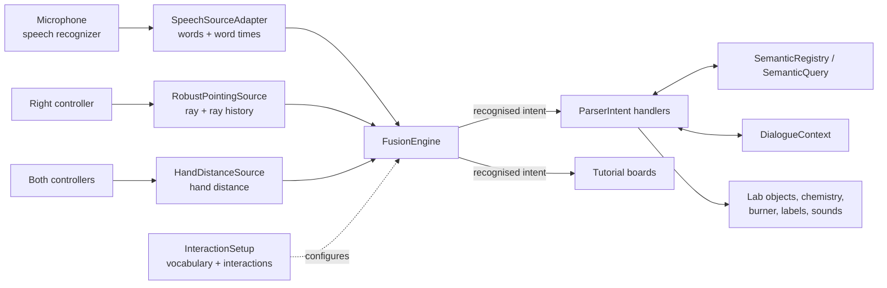

# Multimodal VR Chemistry Lab for Children

A virtual-reality chemistry lab where children set up equipment, add chemicals, mix them and heat them on a Bunsen burner, controlled by **speech**, **pointing** and **hand gestures** instead of controller menus.

> *"Create three red test tubes there."* · *"Put that there."* · *"Make it this big."* · *"Add hydrochloric acid."*


**Author:** [Avi Goyal](https://www.linkedin.com/in/avi-goyal/) · **Built with:** Unity 6000.3.11f1, XR Interaction Toolkit 3.4.1, Meta Quest 3

Developed as a team project in the *Multimodal User Interfaces* course (SS 2026) at the Chair for Human-Computer Interaction, University of Würzburg.

---

## Contents

1. [Why multimodal?](#why-multimodal)
2. [Features](#features)
3. [Chemistry experiments](#chemistry-experiments)
4. [Architecture](#architecture)
5. [How a command is processed](#how-a-command-is-processed)
6. [Commands](#commands)
7. [Getting started](#getting-started)
8. [Project structure](#project-structure)
9. [Testing](#testing)
10. [My contributions](#my-contributions)
11. [Credits and third-party assets](#credits-and-third-party-assets)
12. [Known limitations](#known-limitations)

---

## Why multimodal?

Real chemistry labs are rarely accessible to children: acids, bases and silver nitrate are dangerous, burners are a fire risk, and glassware breaks. A virtual lab removes those risks, but only if children can actually use it. Controller menus are hard to learn and pull attention away from the experiment, so the lab is controlled the way children naturally communicate:

| Modality | Carries | Example |
|---|---|---|
| **Speech** | What to do, what to use: actions, object types, chemicals, colours, counts | *"add hydrochloric acid"*, *"create three test tubes"* |
| **Pointing** | Which object, which place | *"select **that**"*, *"put it **there**"* |
| **Gestures** | Sizes and rotation | *"make it **this** big"* with both hands, wrist twist to rotate |

Each modality contributes the part it's best at. A fusion engine combines them into one command, the same way a teacher would say *"take this beaker and mix it with that one"*.

---

## Features

**Objects and interaction**
- Create, select, move and delete beakers, flasks, test tubes and a Bunsen burner by speech alone or speech + pointing.
- Rows of objects (*"create three red test tubes there"*) with a live preview of where they will appear.
- Two-pointing commands (*"put that there"*), each pointing word bound to its own pointing direction.
- Colour changes and property-based selection (*"select the red beaker"*).
- Resizing by voice (*"make it bigger"*) or by showing the size with both hands (*"make it this big"*).
- Upright-only rotation by voice (*"rotate left"*, *"turn it around"*) or wrist twist.
- Smart placement on surfaces, in the air, or in front of the user.

**Context and dialogue**
- Filters: *"consider only beakers"*, then *"delete this"* while pointing near a flask deletes the beaker next to it.
- References: *"it"* (current selection), *"them"* (last created group), *"again"* (repeat last command).
- Every command accepts at least five alternative phrasings.

**Guidance and feedback**
- **Experiment board:** step-by-step guidance through four experiments, steps tick off automatically.
- **Basics board:** eight hands-on lessons teaching every command, with tips when a command is refused.
- **Help card:** *"what can I say"*.
- Floating labels with chemical notation (H₂O, NaCl), selection highlight, and audio feedback (chime when understood, buzz when refused).

---

## Chemistry experiments

Liquid colour follows the pH of the mixture. Reactions are detected from the combined contents and the heating state.

| Experiment | Reaction | What you see |
|---|---|---|
| Neutralization | HCl + NaOH → NaCl + H₂O | Colour change with the pH |
| Ammonium chloride smoke | HCl + NH₃ → NH₄Cl | Fumes when heated, the container empties |
| Precipitation | AgNO₃ + NaCl → AgCl↓ + NaNO₃ | A white precipitate forms |
| Quicklime and water | CaO + H₂O → Ca(OH)₂ | The mixture heats up and boils itself dry |

---

## Architecture



| Layer | Component | Responsibility |
|---|---|---|
| Input | `SpeechSourceAdapter` | Passes recognised words on and records when each pointing word (*this, that, here, there*) was spoken |
| Input | `RobustPointingSource` | Casts the controller ray every frame and keeps a short ray history |
| Input | `HandDistanceSource` | Measures the distance between both hands |
| Fusion | `FusionEngine` | Generic fusion: collects a sentence, matches it against the configured interactions, fills parameter slots, attaches pointing and gesture samples |
| Configuration | `InteractionSetup` | The application's vocabulary and interaction definitions; also generates the speech recognizer's grammar |
| Semantic integration | `ParserIntent`, `SemanticQuery` | Resolves *"that"* or *"the red beaker"* to real scene objects and calls the application function |
| Context | `DialogueContext` | Keeps the active filter, the last group and the last command between sentences |
| Application | `LabContainer`, `ChemicalDatabase`, `BunsenBurner` | Chemistry, reactions and heating |

The fusion engine contains no application words. Everything specific to the chemistry lab lives in `InteractionSetup`, so the same engine could drive a completely different application.

---

## How a command is processed

Example: the user points at a beaker and says *"select that red beaker"*.

1. **Recognition.** The speech recognizer only knows the words generated from `InteractionSetup` (plus an `[unk]` token for anything else), which keeps recognition accurate and fast.
2. **Fusion.** `FusionEngine` matches *select* as the action, fills `color = red` and `objectType = beaker`, and attaches the ray recorded when *"that"* was spoken. Output:
   ```
   {action:select; target:red beaker (pointed: Beaker_03); color:red; objectType:beaker; pointing:[Beaker_03]}
   ```
3. **Semantic integration.** The `select` handler checks whether the pointed object really is a red beaker. If not, it asks `SemanticQuery` for a red beaker closest to the ray, or refuses the command.
4. **Action.** The beaker is selected and highlighted, and a confirmation sound plays.

When several interactions match a sentence, the longest matching trigger phrase wins; on a tie, the interaction defined first.

---

## Commands

Legend: 🗣 speech only · 👉 speech + pointing · ✋ speech + two-hand gesture

| Interaction | Example | Some alternatives | Input |
|---|---|---|---|
| Create | *"create a beaker"*, *"create three red test tubes there"* | spawn, make, build, give me | 🗣 / 👉 |
| Select | *"select that beaker"*, *"select the red beaker"* | pick, choose, grab | 👉 / 🗣 |
| Move | *"move it there"* | drag, place, bring, carry | 👉 |
| Put that there | *"put that there"* | drop, set, position | 👉 👉 |
| Delete | *"delete this"*, *"delete all test tubes"* | remove, destroy, get rid of | 👉 / 🗣 |
| Change colour | *"color that yellow"*, *"make it red"* | paint, recolor, tint, dye | 👉 |
| Rotate | *"rotate left"*, *"turn it around"* | spin, turn, swivel | 🗣 / 👉 |
| Resize | *"make it bigger"*, *"make it this big"* | enlarge, shrink, this tall, this wide | 🗣 / ✋ |
| Add chemical | *"add hydrochloric acid"* | pour, fill, dissolve | 👉 / selection |
| Mix | *"mix this"* | combine, stir, shake | 👉 |
| Burner | *"turn on the burner"*, *"move to burner"* | light the burner, switch off | 🗣 |
| Filter | *"consider only beakers"*, *"consider everything"* | only, focus on, clear the filter | 🗣 |
| Group / repeat | *"make them blue"*, *"again"* | those, once more | 🗣 |
| Tutorial | *"next lesson"*, *"show experiment two"*, *"what can I say"* | teach me, help | 🗣 |

---

## Getting started

**Requirements:** Unity Hub with Unity 6000.3.11f1, a Meta Quest 3 with Quest Link (cable or Air Link), a microphone.

1. Clone the repository (the project uses Git LFS):
   ```bash
   git lfs install
   git clone https://github.com/GoyalAvi/MultiModal_VR_Chemistry_Lab.git
   ```
2. Open the folder with **Unity 6000.3.11f1** in Unity Hub. The first import takes a few minutes.
3. Open `Assets/Scenes/mmi-getting-started.unity`.
4. Connect the Quest 3 via Quest Link and set the headset microphone as the default Windows input.
5. Press **Play**, point with the right controller and start talking, e.g. *"create a beaker"*.

---

## Project structure

```
Assets/
  Scenes/            Main scene
  Scripts/
    Input/           Input sources and setup (pointing, hand distance, speech wiring)
    Intent/          InteractionSetup.*.cs, ParserIntent.*.cs, DialogueContext, self-checks
    Chemistry/       ChemicalDatabase, LabContainer, BunsenBurner, ContainerLabel
    Objects/         VRObject (semantic properties of lab objects)
    Tutorial/        Experiment board, Basics board
    Audio/           SoundFeedback
Packages/
  fusion-method-package/          FusionEngine, InteractionDefinition, RecognizedIntent
  semantic-integration-package/   ISemanticEntity, SemanticRegistry, SemanticQuery
```

---

## Testing

Self-checks run the real fusion engine with simulated speech, pointing and gesture input. Right-click the **InputTest** component in the Inspector:

| Self-check | Covers |
|---|---|
| Phrasings | Every phrasing of every command resolves to the right interaction, including clash cases |
| Create counts | Numbers in create commands, and that *"next to that"* is not read as a number |
| Context | Filters, *it / them*, *again* |
| Basics board | Lesson steps tick only for the right commands |

---

## My contributions

- **Multimodal fusion method:** the fusion engine, sentence buffering and flushing, trigger matching and tie-breaking, parameter slots, and attaching pointing and gesture samples to the right words.
- **Two-pointing commands:** word-timed pointing so *"put that there"* binds each pointing word to its own direction.
- **Gesture-based modification:** *"make it this big"* with the hand distance sampled at the moment *"this"* is spoken.
- **Alternative phrasings:** the vocabulary design, clash handling between commands, and the automated phrasing self-check.

---

## Credits and third-party assets

**Team:** Avi Goyal and Ayush Srivastava. Course: *Multimodal User Interfaces*, SS 2026, Chair for Human-Computer Interaction, University of Würzburg.

| Source | Used for |
|---|---|
| Unity URP, Shader Graph, XR Interaction Toolkit, OpenXR / Oculus XR Plugin, TextMesh Pro, glTFast | Rendering, XR, text, model loading |
| Recognissimo with [Vosk](https://alphacephei.com/vosk/models) language models | Offline speech recognition |
| Course template (speech and gesture wrappers) | Starting point of the project |
| [Interface Sounds by Kenney](https://kenney.nl/assets/interface-sounds) (CC0) | Feedback sounds |
| 3D models and textures (glassware, Bunsen burner, room) | Lab objects and environment |

---

## Known limitations

- One colour per sentence.
- Two commands spoken without a pause can merge into one.
- Two-pointing timing depends on the recognizer delivering partial results.
- *"Delete all"* only removes objects created by voice.
- Recognition quality depends on the microphone and background noise.
